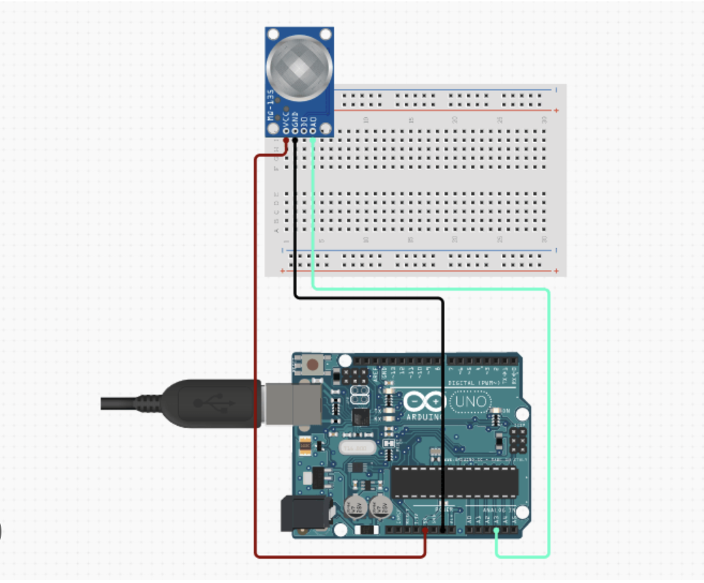
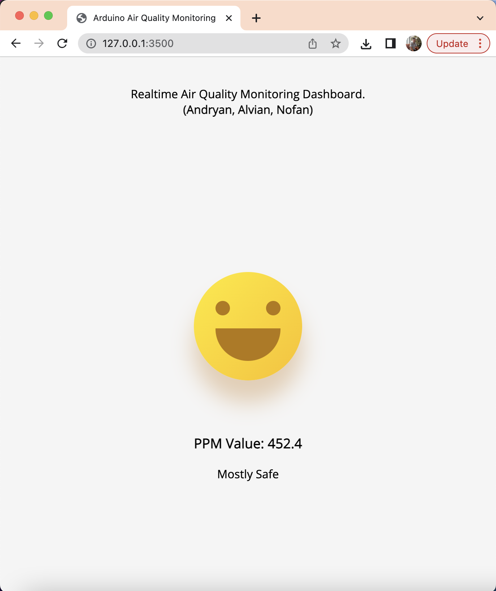
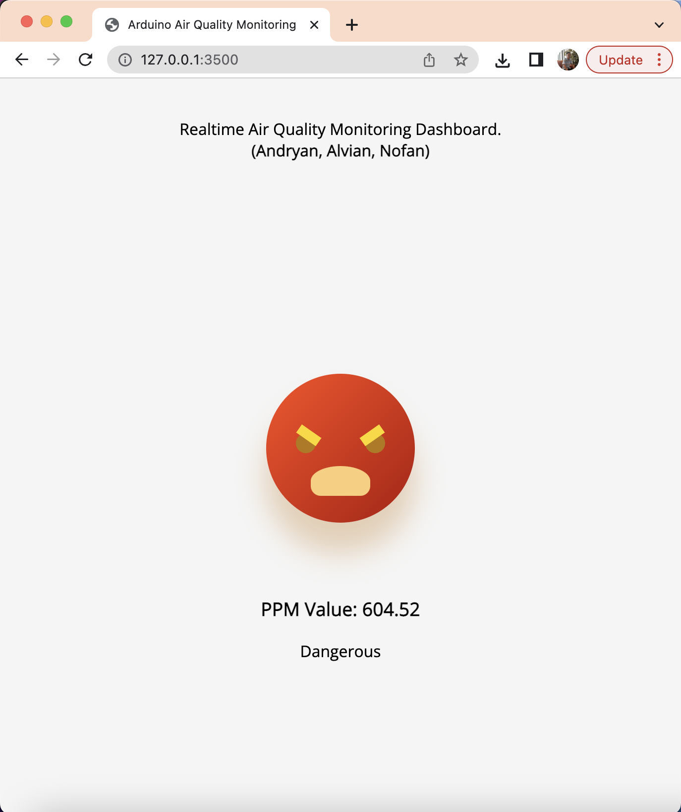

# AQING (Air Quality Monitoring - Dashboard)

`Air Quality Monitoring - Dashboard (AQING - Dashboard) adalah dasbor monitoring kualitas udara yang ditulis dengan Python untuk memantau kualitas udara sekitar dengan menggunakan sensor MQ135 dan juga Arduino`

## Init
1. Do interfacing to the Arduino and MQ135 sensor

2. Using .ino file in this repo, compile and upload to the arduino UNO.
3. Manually adjust come configs like desired COM Port, MySQL DB Config, etc.
4. Execute .sql files from the ddl folder to init the db and its table.
5. Run the service for getting data from the sensor by runnning command below
`python3 python_web/air_quality.py`
6. Open new terminal window, run the flask web server to serve the web by runnning command below
`python3 python_web/main.py`

## Demo
`Safe`

`Danger`

## Created By
Andryan, Alvian, Nofan